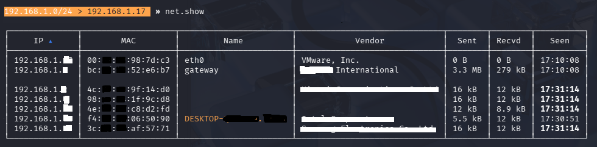

# home-wifi-security-observation-lab
## Introduction
This project documents a legal and ethical home Wi-Fi security observation lab focused on passive network monitoring and traffic analysis.  
The goal of this lab is to understand how devices behave on a private network and how normal traffic patterns appear from a defensive security perspective.

All activities were conducted on a privately owned network using devices owned by the author. No active attacks, interception, or traffic manipulation were performed.

## Lab Environment
The lab was conducted using the following environment:

- **Operating System:** Kali Linux (running in VMware)
- **Network Type:** Private home Wi-Fi network
- **Client Device:** Android smartphone (Infinix)
- **Gateway:** Home router
- **Tools Used:**
  - Bettercap (passive network discovery only)
  - Wireshark (read-only traffic capture)

The virtual machine was bridged to the physical network to allow visibility of real network traffic while maintaining a controlled and ethical testing environment.

## Objectives
The objectives of this project are:

- To identify devices connected to a private home Wi-Fi network
- To observe normal network communication patterns using passive monitoring
- To understand how client devices interact with the network gateway
- To analyze basic protocol behavior without intercepting or modifying traffic
- To develop foundational skills in ethical and defensive network security analysis

## Methodology
The project followed a passive observation approach to ensure ethical and non-intrusive analysis.

The methodology consisted of the following steps:

- Connecting a Kali Linux virtual machine to the private Wi-Fi network using a bridged network configuration
- Identifying connected devices through passive network discovery
- Observing communication between the client device and the network gateway
- Capturing network traffic in read-only mode to study protocol behavior
- Filtering traffic related to a single client device to reduce noise and focus on baseline behavior

No traffic interception, manipulation, spoofing, or active attacks were performed during this project.

## Observations
During the passive monitoring phase, the following observations were recorded:

- The Android client device primarily communicated with the network gateway
- Most outbound traffic was encrypted, indicating the use of secure protocols
- Periodic name service queries were observed as part of normal device discovery behavior
- Occasional destination unreachable messages were returned by the gateway
- Network traffic patterns changed when the client device became actively used

No abnormal broadcast behavior or unexpected redirection patterns were observed during the monitoring period.

## Ethical and Legal Notice
All activities documented in this project were conducted on a privately owned network using devices owned by the author.

The project was strictly limited to passive observation and read-only traffic analysis. No interception, spoofing, manipulation, or active attacks were performed at any stage.

This lab was designed solely for educational purposes to develop defensive cybersecurity knowledge and ethical network analysis skills.

## Visual References

The following screenshot shows passive network device discovery performed during the lab.  
All sensitive information has been sanitized.

